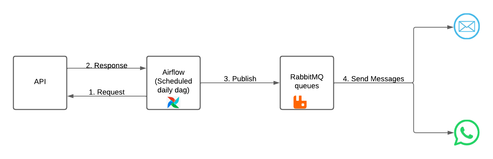

# Message-Manager



This project aims to create a messaging system to manage messages sent via email and WhatsApp, working on them in an asynchronous and scalable way. It also has the functionality to save logs and send personalized messages for each type of subject.

**Note**: The templates, producer file and example of use in the Readme file in this project were based on the premise of being used in another project on my GitHub, this being a vehicle API, therefore the messages and subjects are configured as such . To use for personal purposes you need to create your own templates which will have the same names as the subjects you define on the command line to start the consumer
## [Video about the project in PT-BR](https://share.vidyard.com/watch/YzRf1mSsK6e97Ddvq7iPs1?)

## Structure
### Consumers
This folder contains the files to start consumer queues for email and Whatsapp

### dags
This is the Dag file used to create a scheduled function using Airflow to supply the queues by calling an API

### testapi
Testing API to test the use of the DAG

### producer
File to test consumers if you don't want to use the DAG, you can send messages directly from this file and check the consumers' operation without initializing the DAGs or TestApi

## Usage
1. Clone the repository on your device
2. Go to the project directory
3. Create a virtual environment on your device
> python -m venv venv 

4. Run the virtual environment, if you are using the Windows operating system, use the following command
> venv/Scripts/activate

But if you use Linux OS or MAC use the command below
> source venv/Scripts/activate

5. Install the libraries saved in the requirements.txt file, if you are using the PIP package manager you can use the following command
> pip install -r requirements.txt

6. Create the .env file with the next parameters, regarding the email password, read [Google's documentation](https://support.google.com/mail/answer/185833?hl=en) on how to create an application password.
```
PORT=465
PASSWORD=insert_the_password_app
EMAIL=insert_your_email@email.com
```

7. [Optional] Replace the files in the subdirectories of the template folder with the files you want to use in email and Whatsapp consumers

8. Run as many instances as you want of the WhatsApp email consumer,If you replace the templates in step 7 you need to replace the third parameter that represents the subjects with the set of names of your templates separated by ";"
> python consumers/consumer.py 'e-mail' 'email_queue' 'appointment;devolution;late devolution;invoice'
> python consumers/consumer.py 'whatsapp' 'whatsapp_queue' 'appointment;devolution;late devolution;invoice'

## Optional Usage
You can also run the DAG in the dags folder, you need to make sure you have Airflow running on your machine and then place the file in the dags folder and update the API url if necessary.

If you wish, you can run the test API to check the functioning of the DAG. To do this, you need to run the command below and make sure that the files "email_messages.json" and "whatsapp_messages.json" with the test data are in the same directory as the API.
> flask --app testapi run

## Tests
For testing purposes you can also run the Producer.py file which will read two json files in the same directory called "email_messages.json" and "whatsapp_messages.json" and send the messages to the respective consumers.

** Note ** The comment in this file explains an example of use for this project's test templates
